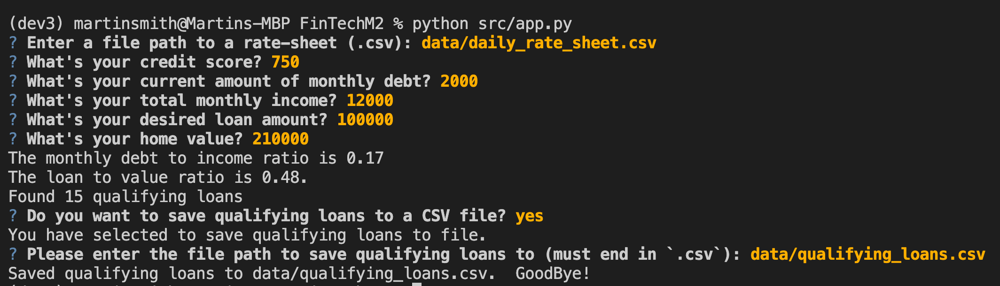
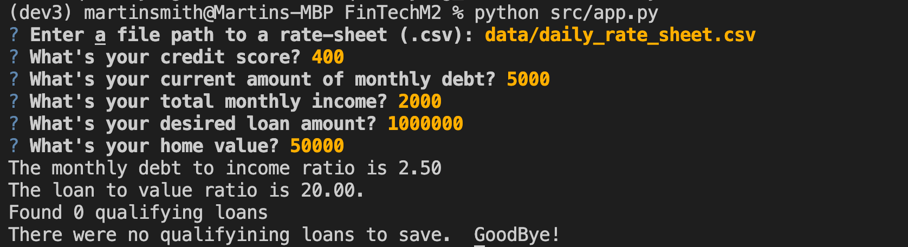
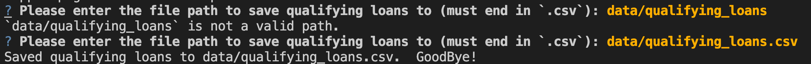

# loan_qualifier

**loan_qualifier** is an application that enables users to share qualifying loans using a spreadsheet by guiding users, through interactive prompts, to save qualifying loans to a CSV file. 

---

## Technologies

Technologies used in this project:

* **python 3.7** - the solution is implemented in python
* **questionary** - The questionary library is used to facilitate interactive CLI
* **fire** - the fire library is used to facilitate cli configuration

---

## Usage

### Installation
To install the program in your environment, first clone this repo into a specifid location in your environment:
```
% cd <path to folder that will contain the repo>
% git clone https://github.com/CAMPSMITH/loan_qualifier.git
```

### Install Dependencies
The required dependencies for this program can easily be installed using the *requirements.txt* file within the repo.  It is recommended that you use a virtual environment to avoid conflicts with other programs in your environment.  Assuming that the above command was just executed as stated, the path to the repo should be *loan_qualifier*.  Adjust as needed for your environment.  
```
% cd loan_qualifier
% conda create -n <name of your virtual environment> python=3.7 anaconda
% conda activate <name of your virtual environment>
% pip install -r requirements.txt
```
Remember to deactivate your virtual environment after you are done using the program with `conda deactivate`

### Running the program
To run the program, assuming that you have
* cloned this repo 
* created a virtual environment
* installed dependencies
* navigated to the root of the repo

Execute the following command:
```
python src/app.py
```
Answer the prompts as appropriate for your loan parameters.  The following screenshot demonstrates a user session where the user requests to save the qualifying loans to a file.

#### **notes**
 1. The rate sheet must be a valid path to a csv containing the rate sheet in the appropriate format
 1. When responding to the question `Do you want to save qualifying loans to a CSV file?`, use the up and down arrow keys to select the desired response.
 1. The user does not have to save qualifying loans to file. In cases where the selected option is to not save qualifying loans to file, the program will simply terminate.
 1. In cases where there are no qualifying loans meeting the selected criteria, the program will notify the user and terminate, see 
 1. When saving qualifying loans to file, the provided path must end in .csv or it will not be accepted.  The user will be re-prompted until a valid path is provided. see 


---

## Contributors

*  **Martin Smith** <span>&nbsp;&nbsp;</span> |
<span>&nbsp;&nbsp;</span> *email:* msmith92663@gmail.com <span>&nbsp;&nbsp;</span>|
<span>&nbsp;&nbsp;</span> [](https://www.linkedin.com/in/smithmartinp/)


---

## License

[](LICENSE)


